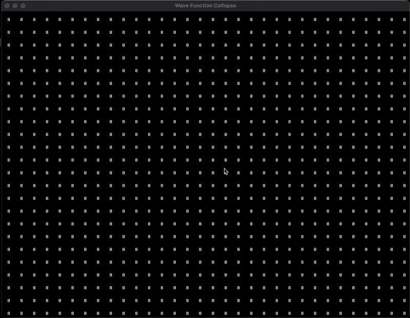

## Wave Function Collapse Algorithm (WFC) implementation in C++ with Raylib

This is a simple implementation of the Wave Function Collapse algorithm in C++ using the Raylib library for rendering. The algorithm is used to generate random 2D patterns based on a sample images. The algorithm is based on the paper by Maxim Gumin and is implemented in C++ using the Raylib library for rendering.

## Screenshots

## How to use

The program is very simple to use. To generate a new pattern, simply press the space bar.

## How it works

The algorithm basically works like a sudoku solver. It starts with a grid of pixels and a set of sample images. It then tries to fill the grid with the sample images in such a way that the resulting image is as similar as possible to the sample images. The algorithm works by looking at the neighboring pixels and trying to find a sample image that fits the best.

## How to compile

1. Clone the repository using `git clone --recursive https://github.com/wave_function_collapse.git`
2. Run `mkdir build && cd build`
3. Run `cmake ..`
4. Run `make`
5. Run `./wfc`

## Dependencies

- [Raylib](https://www.github.com/raysan5/raylib)
- [CMake](https://cmake.org/)

# Tiles

The tiles are from the [@GarnetKane](https://www.youtube.com/@GarnetKane)'s [video](https://www.youtube.com/watch?v=3g440SA2hKU&t=621s). I only split the image into parts and used it as sample images for the WFC algorithm.
